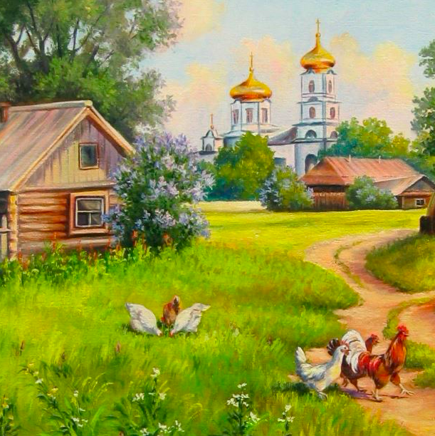
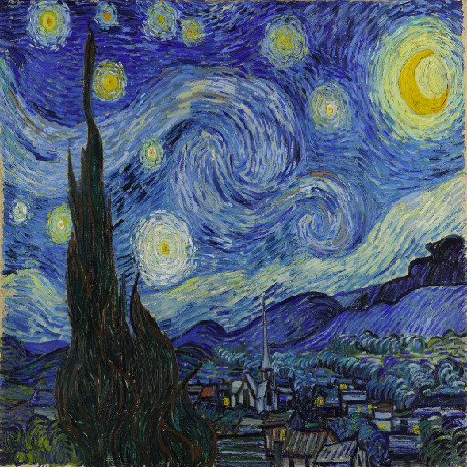

### About the Project:

- This software transfers style of one image to other image with the help of pre-tranied VGG16 network. Used Keras Backend for the implementation. 

### Base Image:

### Style Image:

### Combined Image:

